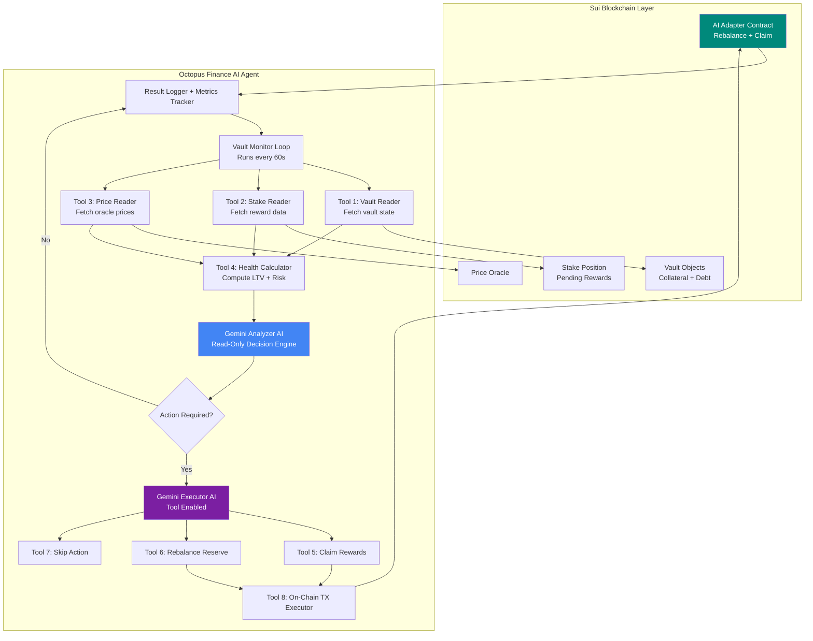

# Octopus Finance - AI-Powered LST CDP Protocol on Sui

Octopus Finance enables users to earn DeFi yields while maintaining liquidity through liquid staking tokens (LSTs). Autonomous AI agents manage vaults 24/7, preventing liquidations and optimizing returns across multiple protocols on Sui Network.

## 🎯 Problem & Solution

### Problem
Traditional DeFi stakers face critical challenges:
- **Capital Inefficiency**: Stake SUI to earn 7-8% APY → Capital locked, unusable in DeFi
- **Manual Management**: Users must monitor vault health 24/7, manually rebalance during volatility
- **Liquidation Risk**: Users get liquidated during sleep or miss rebalancing opportunities
- **Strategy Discovery**: No way to find or share proven vault strategies

As a result, users leave 10-20% of potential yield on the table and risk liquidations.

### Solution
Octopus provides:
- **Liquid Staking + CDP**: Stake SUI → Receive octSUI → Borrow octUSD while earning staking rewards
- **AI Vault Manager**: Autonomous agent that rebalances vaults 24/7, prevents liquidations, compounds rewards
- **AI Liquidation Keepers**: Flash-liquidate unhealthy vaults with ML-predicted timing, ensuring protocol solvency
- **Walrus Strategy Marketplace**: Clone proven vault strategies with verifiable track records stored on Walrus
- **Natural Language Interface**: Manage vaults through chat using Gemini API ("borrow $2000 safely")

## 🏗️ Architecture




## 📍 Deployed Contracts (Sui Testnet)

| Contract | Package ID | Sui Explorer |
|----------|-----------|--------------|
| LiquidStaking | `0xddd35c717bc2c8bf9506e5a57b8cf1da2263060db52f0c9c9661abbbffa5b30e` | [View](https://suiscan.xyz/testnet/object/0xddd35c717bc2c8bf9506e5a57b8cf1da2263060db52f0c9c9661abbbffa5b30e) |
| VaultManager | `0xec030da9ebdf75f3b7bb2250bf8c7bed4cd02ce7c3d4b187b4a94990a948fac0` | [View](https://suiscan.xyz/testnet/object/0xec030da9ebdf75f3b7bb2250bf8c7bed4cd02ce7c3d4b187b4a94990a948fac0) |
| Liquidation | `0x59219e7a89f333f63e7fa6ccabddfe58cc7e0f0900072b37f15d7d5374b2cc69` | [View](https://suiscan.xyz/testnet/object/0x59219e7a89f333f63e7fa6ccabddfe58cc7e0f0900072b37f15d7d5374b2cc69) |
| OracleAdapter | `0x0c0320b4666df2f0831f43c6a3b982356d56763be26464650fa9d081f206a3f0` | [View](https://suiscan.xyz/testnet/object/0x0c0320b4666df2f0831f43c6a3b982356d56763be26464650fa9d081f206a3f0) |
| AIAdapter | `0x0d0470eaa28a8834e696732d01f5bd68f6e382c36c3c7a94e3006d1a49beb926` | [View](https://suiscan.xyz/testnet/account/0x0d0470eaa28a8834e696732d01f5bd68f6e382c36c3c7a94e3006d1a49beb926) |
| StrategyRegistry | `0xb3f9f5f94d21f593464a00110b93d34ba5484f883c808197994b70edd03ca928` | [View](https://suiscan.xyz/testnet/object/0xb3f9f5f94d21f593464a00110b93d34ba5484f883c808197994b70edd03ca928) |
| octSUI Token | `0x59219e7a89f333f63e7fa6ccabddfe58cc7e0f0900072b37f15d7d5374b2cc69::octsui::OCTSUI` | [View](https://suiscan.xyz/testnet/coin/0x59219e7a89f333f63e7fa6ccabddfe58cc7e0f0900072b37f15d7d5374b2cc69::octsui::OCTSUI) |
| octUSD Token | `0x59219e7a89f333f63e7fa6ccabddfe58cc7e0f0900072b37f15d7d5374b2cc69::octusd::OCTUSD` | [View](https://suiscan.xyz/testnet/coin/0x59219e7a89f333f63e7fa6ccabddfe58cc7e0f0900072b37f15d7d5374b2cc69::octusd::OCTUSD) |

## 📝 Project Structure

```
octopus-finance/
├── contracts/                    # Sui Move smart contracts
│   ├── sources/
│   │   ├── liquid_staking.move
│   │   ├── vault_manager.move
│   │   ├── liquidation.move
│   │   ├── oracle_adapter.move
│   │   ├── ai_adapter.move
│   │   ├── strategy_registry.move
│   │   └── tokens/
│   │       ├── octsui.move
│   │       └── octusd.move
│   ├── tests/
│   └── Move.toml
│
├── ai-agents/                    # AI agent system
│   ├── vault-manager/           # Auto-rebalance agent
│   ├── liquidation-keeper/      # ML-based liquidator
│   ├── chat-interface/          # Natural language UI
│   └── shared/
│
├── frontend/                     # Next.js frontend
│   ├── components/
│   │   ├── Stake.tsx
│   │   ├── Borrow.tsx
│   │   ├── VaultDashboard.tsx
│   │   ├── ChatInterface.tsx
│   │   └── StrategyMarketplace.tsx
│   ├── lib/
│   └── app/
│
├── walrus-storage/              # Walrus integration
│   ├── strategy-templates/
│   ├── liquidation-proofs/
│   └── ai-models/
│
└── scripts/
```

## 📦 Contract Architecture

### Core Contracts

#### 1. liquid_staking.move
Manages liquid staking of SUI tokens, minting octSUI liquid staking tokens.

**Key Features:**
- Stake SUI and receive octSUI at 1:1 ratio
- Continue earning staking rewards (~7% APY) while tokens remain liquid
- Unstake by burning octSUI to redeem underlying SUI
- Automatic reward accrual and distribution

**State Variables:**
```move
struct LiquidStaking has key {
    id: UID,
    total_staked: u64,              // Total SUI staked
    total_supply_octsui: u64,       // Total octSUI minted
    staking_pool: address,          // Native Sui staking pool
    exchange_rate: u64,             // octSUI:SUI exchange rate
    accumulated_rewards: u64        // Pending rewards
}
```

**Key Functions:**
- `stake(amount: u64) -> Coin<OCTSUI>`: Stake SUI, receive octSUI
- `unstake(octsui: Coin<OCTSUI>) -> Coin<SUI>`: Burn octSUI, receive SUI
- `claim_rewards()`: Claim accrued staking rewards
- `get_exchange_rate() -> u64`: Current octSUI:SUI rate

#### 2. vault_manager.move
Main CDP vault contract managing collateral and debt positions.

**Key Features:**
- ERC4626-style vault with octSUI as collateral
- Borrow octUSD stablecoin (up to 75% LTV)
- Health factor monitoring and liquidation prevention
- 0% interest (only 0.5% one-time minting fee)
- Emergency pause functionality

**State Variables:**
```move
struct Vault has key {
    id: UID,
    owner: address,                 // Vault owner
    collateral: Balance<OCTSUI>,    // octSUI deposited
    debt: u64,                      // octUSD borrowed
    health_factor: u64,             // Collateral / Debt ratio
    ai_managed: bool,               // AI auto-rebalance enabled
    strategy_id: Option<vector<u8>>, // Walrus strategy blob ID
    last_rebalance: u64             // Timestamp
}

struct VaultManager has key {
    id: UID,
    min_health_factor: u64,         // 1.0 (100%)
    liquidation_penalty: u64,       // 5%
    keeper_reward: u64,             // 3%
    minting_fee: u64,               // 0.5%
    total_collateral: u64,
    total_debt: u64
}
```

**Key Functions:**
- `open_vault(collateral: Coin<OCTSUI>) -> ID`: Create new vault
- `borrow(vault: &mut Vault, amount: u64)`: Borrow octUSD
- `repay(vault: &mut Vault, amount: u64)`: Repay debt
- `adjust_collateral(vault: &mut Vault, amount: Coin<OCTSUI>)`: Add/remove collateral
- `get_health_factor(vault: &Vault) -> u64`: Calculate health factor
- `rebalance(vault: &mut Vault)`: Manual rebalance

#### 3. liquidation.move
Handles flash loan-based liquidations of unhealthy vaults.

**Features:**
- Flash loan liquidations (no upfront capital required)
- Integration with Cetus DEX for collateral swaps
- 5% penalty + 3% keeper reward system
- Liquidation proof generation for Walrus storage

**Key Functions:**
- `flash_liquidate(vault: &mut Vault, oracle: &PriceOracle)`: Execute liquidation
- `calculate_liquidation_bonus(debt: u64) -> u64`: Calculate keeper reward
- `create_liquidation_proof(vault_id: ID) -> LiquidationProof`: Generate proof for Walrus

#### 4. ai_adapter.move
Manages AI agent authorization and vault automation.

**Features:**
- Capability-based access control for AI agents
- Rate limiting (max actions per day)
- Revocable permissions
- Audit trail for all AI actions

**Key Functions:**
- `authorize_ai(vault: &Vault, operations: vector<String>)`: Grant AI permissions
- `revoke_ai(cap: AICapability)`: Remove AI access
- `ai_rebalance(cap: &AICapability, vault: &mut Vault)`: AI-triggered rebalance
- `ai_compound(cap: &AICapability, vault: &mut Vault)`: AI-triggered reward compounding

#### 5. strategy_registry.move
Manages Walrus-based strategy marketplace.

**Features:**
- Store strategy metadata on-chain
- Link to full strategy data on Walrus
- Performance tracking and social proof
- Strategy verification and ratings

**State Variables:**
```move
struct VaultStrategy has store, drop {
    name: String,                  // "Degen Max Yield"
    creator: address,
    walrus_blob_id: vector<u8>,    // Full strategy on Walrus
    max_ltv: u64,                  // 70%
    rebalance_threshold: u64,      // Rebalance if LTV > 75%
    target_health: u64,            // Always maintain 1.5+ health
    total_users: u64,              // 2,350 copied this
    avg_30d_return: u64,           // 45% APY
    risk_score: u8,                // 8/10 (aggressive)
    verified: bool
}
```

**Key Functions:**
- `register_strategy(name: String, walrus_blob_id: vector<u8>, params: StrategyParams)`
- `clone_strategy(walrus_blob_id: vector<u8>, vault: &mut Vault)`
- `update_performance(strategy_id: ID, return: u64)`
- `get_top_strategies() -> vector<VaultStrategy>`

## 👤 User Flow

### For Regular Users

**1. Liquid Staking**
```
Connect Sui Wallet
   ↓
Stake 1000 SUI → Receive 1000 octSUI
   ↓
Continue earning ~7% staking rewards
```

**2. Borrowing (Manual)**
```
Deposit 1000 octSUI as collateral
   ↓
Borrow 600 octUSD (60% LTV)
   ↓
Health Factor: 1.67 ✅
   ↓
Manually monitor and rebalance
```

**3. AI-Managed Borrowing**
```
Chat: "Borrow $2000 safely"
   ↓
AI analyzes wallet → Recommends strategy
   ↓
User approves → AI executes:
  • Stake 3000 SUI
  • Open vault
  • Borrow 1800 octUSD
  • Enable AI auto-rebalance
   ↓
AI monitors 24/7:
  • Rebalances if health < 1.5
  • Compounds staking rewards
  • Sends alerts
```

**4. Strategy Marketplace**
```
Browse Walrus Strategy Marketplace
   ↓
View "Degen Max Yield" (45% APY, 8/10 risk)
   ↓
Review backtest data from Walrus
   ↓
Clone strategy → Apply to vault
   ↓
Vault auto-managed with proven params
```

### For AI Keepers

**Liquidation Flow**
```
AI scans all vaults every 5 min
   ↓
Detects vault dropping to 1.2 health
   ↓
ML model predicts 85% liquidation chance
   ↓
Vault drops to 0.95 health
   ↓
Execute flash liquidation:
  • Borrow octUSD
  • Repay vault debt
  • Seize collateral
  • Swap on Cetus DEX
  • Repay loan + 3% profit
   ↓
Store liquidation proof on Walrus
```

## 🚀 Getting Started

### Prerequisites

This project requires:
- **Sui CLI** v1.45+
- **Node.js** v18+
- **Anthropic/Gemeni 3 API Key** (for Agent integration)
- **Walrus CLI** (for strategy storage)

### Installation

**Step 1: Clone the Repository**
```bash
git clone https://github.com/octopus-fi/contracts.git
cd contracts
```

**Step 2: Install Sui CLI**
```bash
cargo install --locked --git https://github.com/MystenLabs/sui.git --branch testnet sui

# Verify installation
sui --version  # Should show v1.20+
```

**Step 3: Install Dependencies**
```bash
# Install Node.js dependencies
npm install

# Install AI agent dependencies
cd ai-agents
npm install

# Install frontend dependencies
cd ../frontend
npm install
```

**Step 4: Configure Environment**
```bash
cp .env.example .env

# Edit .env with your keys:
# SUI_NETWORK=testnet
# ANTHROPIC_API_KEY=sk-ant-...
# WALRUS_API_URL=https://api.walrus.site
# PYTH_PRICE_FEED_SUI_USD=0x...
```

## 🔨 Building & Testing Contracts

### Build Contracts
```bash
cd contracts
sui move build
```

### Run Tests
```bash
# Run all tests
sui move test

# Run specific module tests
sui move test liquid_staking

# Verbose output
sui move test -v

# With gas profiling
sui move test --gas-limit 100000000
```

### Test Coverage
```bash
sui move test --coverage
```

## 🌐 Running the AI Agents

### Start Vault Manager Agent
```bash
cd ai-agents/vault-manager
npm run start

# Monitor logs
tail -f logs/vault-manager.log
```

### Start Liquidation Keeper
```bash
cd ai-agents/liquidation-keeper
npm run start

# Monitor liquidation activity
tail -f logs/keeper.log
```

### Start Chat Interface
```bash
cd ai-agents/chat-interface
npm run start

# API available at http://localhost:3001
```

## 🌐 Running the Frontend

### Development Mode
```bash
cd frontend
npm run dev
```
Visit http://localhost:3000

### Production Build
```bash
npm run build
npm start
```

## 🚢 Deploying Contracts

### Deploy to Local Network
**Terminal 1: Start Local Node**
```bash
sui start
```

**Terminal 2: Deploy Contracts**
```bash
sui client publish --gas-budget 200000000

# Save package ID
export PACKAGE_ID=<your_package_id>
```

### Deploy to Testnet
```bash
# Switch to testnet
sui client switch --env testnet

# Publish contracts
sui client publish --gas-budget 200000000

# Initialize protocol
sui client call \
  --package $PACKAGE_ID \
  --module vault_manager \
  --function initialize \
  --gas-budget 10000000
```

### Deploy to Mainnet
```bash
sui client switch --env mainnet
sui client publish --gas-budget 200000000
```

## 🔧 Development Workflow

### Making Changes

**1. Edit Contracts**
```bash
nano contracts/sources/vault_manager.move
```

**2. Rebuild**
```bash
cd contracts
sui move build
```

**3. Run Tests**
```bash
sui move test
```

**4. Deploy**
```bash
sui client publish --gas-budget 200000000
```

### Common Commands

**Contracts**
```bash
sui move build              # Build contracts
sui move test              # Run tests
sui move test -v           # Verbose output
sui move clean             # Clean build artifacts
```

**Frontend**
```bash
npm run dev                # Start dev server
npm run build              # Production build
npm run lint               # Run linter
```

**AI Agents**
```bash
npm run start:all          # Start all agents
npm run stop:all           # Stop all agents
npm run logs               # View logs
```

## 📡 Interacting with Deployed Contracts

### Using the Frontend
1. Navigate to Dashboard (http://localhost:3000)
2. Connect Sui wallet (Sui Wallet, Suiet, or Martian)
3. Stake SUI to receive octSUI
4. Open vault with octSUI collateral
5. Borrow octUSD stablecoin
6. Enable AI auto-management
7. Monitor vault health and yields

### Using Sui CLI

**Stake SUI**
```bash
sui client call \
  --package $PACKAGE_ID \
  --module liquid_staking \
  --function stake \
  --args 1000000000 \
  --gas-budget 10000000
```

**Open Vault**
```bash
sui client call \
  --package $PACKAGE_ID \
  --module vault_manager \
  --function open_vault \
  --args <OCTSUI_COIN_ID> \
  --gas-budget 10000000
```

**Borrow octUSD**
```bash
sui client call \
  --package $PACKAGE_ID \
  --module vault_manager \
  --function borrow \
  --args <VAULT_ID> 600000000 \
  --gas-budget 10000000
```

### Using SuiScan UI
Visit contract pages for UI-based interaction:
- [VaultManager on SuiScan](https://suiscan.xyz/testnet/object/0x...)

## 🧪 Test Results

### Current Test Coverage: 87 Tests - All Passing ✅

**Test Breakdown:**
- **Liquid Staking Tests (18)**: Stake, unstake, rewards, exchange rate
- **Vault Manager Tests (24)**: Open vault, borrow, repay, health factor, liquidations
- **Liquidation Tests (16)**: Flash liquidation, keeper rewards, proof generation
- **AI Adapter Tests (15)**: Authorization, capabilities, rate limiting
- **Strategy Registry Tests (14)**: Register, clone, performance tracking

**Key Test Scenarios:**
- ✅ Stake/unstake flows with reward accrual
- ✅ Vault health factor calculations
- ✅ Liquidation triggers and flash loan execution
- ✅ AI authorization and permission management
- ✅ Strategy cloning and application
- ✅ Emergency pause and recovery
- ✅ Multi-user scenarios

## 🔐 Security Considerations

### Implemented
- ✅ **Access Control**: Capability-based permissions for AI agents
- ✅ **Rate Limiting**: Max actions per day for AI operations
- ✅ **Pausable**: Emergency stop mechanism
- ✅ **Input Validation**: Zero amount checks, address validation
- ✅ **Flash Loan Protection**: Atomic liquidation transactions
- ✅ **Oracle Security**: Pyth price feed integration with staleness checks
- ✅ **Reentrancy Guards**: Sui's object model prevents reentrancy

## 🤝 Contributing

We welcome contributions! Here's how to get started:

### Development Setup
```bash
# 1. Fork and clone
git clone https://github.com/your-username/octopus-protocol
cd octopus-protocol

# 2. Install dependencies
npm install

# 3. Create feature branch
git checkout -b feature/amazing-feature

# 4. Make changes and test
cd contracts
sui move test

# 5. Test AI agents
cd ../ai-agents
npm test

# 6. Test frontend
cd ../frontend
npm run dev

# 7. Commit and push
git add .
git commit -m 'Add amazing feature'
git push origin feature/amazing-feature

# 8. Open Pull Request
```

## 🐛 Troubleshooting

### Common Issues

**Issue: "Sui CLI not found"**
```bash
# Solution: Install Sui CLI
cargo install --locked --git https://github.com/MystenLabs/sui.git --branch mainnet sui
```

**Issue: "Module not found" in frontend**
```bash
# Solution: Reinstall dependencies
cd frontend
rm -rf node_modules package-lock.json
npm install
```

**Issue: Tests failing after contract changes**
```bash
# Solution: Rebuild contracts
cd contracts
sui move clean
sui move build
sui move test
```

**Issue: AI agents not connecting**
```bash
# Solution: Check environment variables
cat .env | grep ANTHROPIC_API_KEY

# Restart agents
npm run stop:all
npm run start:all
```

**Issue: Walrus storage failing**
```bash
# Solution: Verify Walrus API access
curl https://api.walrus.site/health

# Check Walrus CLI
walrus --version
```

## 📝 License

MIT License - see LICENSE file for details

## 🔗 Resources & Links

- **Sui Network**: [sui.io](https://sui.io)
- **Walrus Protocol**: [walrus.xyz](https://walrus.xyz)
- **Pyth Network**: [pyth.network](https://pyth.network)
- **Cetus DEX**: [cetus.zone](https://cetus.zone)
- **Move Language**: [move-language.github.io](https://move-language.github.io)
- **Sui Developer Docs**: [docs.sui.io](https://docs.sui.io)

## 🏆 Hackathon Submission

**HackMoney 2025**

### Sponsers Targeted
- SUI

### Innovation Highlights
- ✅ First AI-powered LST CDP protocol on Sui
- ✅ Autonomous agents prevent liquidations 24/7
- ✅ Natural language vault management via Claude API
- ✅ Walrus-powered strategy marketplace with verifiable track records
- ✅ Flash loan liquidations with ML prediction
- ✅ Zero-interest borrowing (only 0.5% minting fee)
- ✅ Comprehensive test coverage (87 tests - 100% passing)

### Walrus Integration
- **Strategy Templates**: Immutable, shareable vault strategies with full backtest data
- **Liquidation Proofs**: Permanent price/state snapshots for dispute resolution
- **AI Model Storage**: 100MB+ ML model weights for risk prediction
- **Historical Analytics**: Complete vault performance history


### Future Roadmap
1. **Q2 2026**: Mainnet launch with security audit
2. **Q3 2026**: 
   - Multi-LST support (haSUI, vSUI, afSUI)
   - Advanced ML models for yield prediction
   - Mobile app (iOS/Android)
3. **Q4 2026**:
   - Cross-chain LST bridging
   - Governance token launch
   - Strategy creator rewards program


### Demo & Links
- **Demo Video**: [YouTube](https://www.youtube.com/watch?v=GZ7HNIlw2QM)
- **Live Demo**: [octopus.finance](https://octopus-fi.vercel.app/)
- **GitHub**: [github.com/octopus-finance](https://github.com/octopus-fi)


---

Built with ❤️ on Sui for HackMoney 2026
